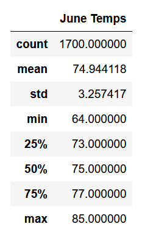
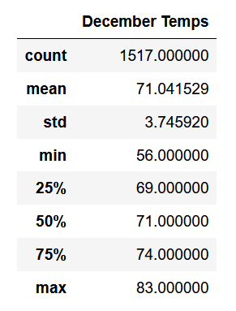
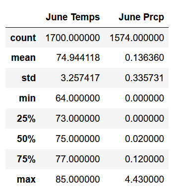

# Surfs-up Challenge
## Overview of the analysis:
### Purpose
With the intention to start Surf and Shake shop we are using the SQLite and SQL Alchemy to analyze the weather data and show the results to Avy who is interested in investing in the business. Avy wants to see the results of temperature data for months of June and December in Oahu, to determine if the surf and ice cream shop business is sustainable year-around. Hence performing the analysis of June and December results.
## Results
### Statistical analysis
* June has warmer weather compared to December
* June has mean temperature of 74.94 whereas December has mean temperature of 71.04.
* Min temperature in June is 64 whereas December was 56.
* Max temperature was seen in June with 85 whereas December was 83, though not very significant difference.
* In June 1700 data points were collected whereas in December 1517 were collected, this could have impacted results as they are not equal. However, its only assumption.

## Summary: 
### High level analysis and additional recommendations
Temperatures in June are warmer compared to December, though not a very significant difference is seen in temperatures. Precipitation for the months of June and December can also be seen for better analysis of weather. Precipitation in June has min of 0.0 and max of 4.4 whereas in December it is min of 0.2 and max of 6.4 suggesting more chances of rain in december. We can conclude through this analysis that we can expect more tourists in June than December due to the weather conditions.

 

